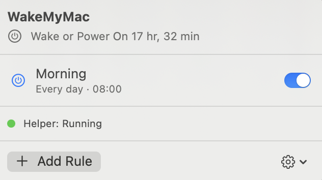
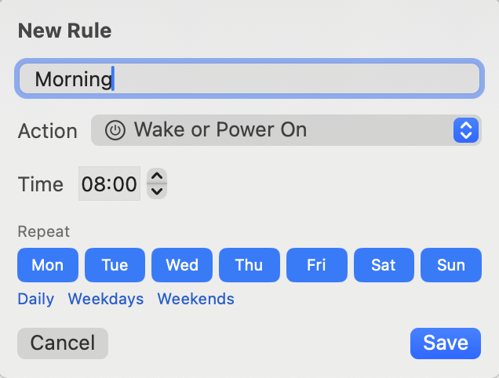

# WakeMyMac

A macOS menu bar app that wakes, powers on, sleeps, shuts down or restarts your Mac on a schedule. You define recurring rules like "power on weekdays at 07:00" or "sleep every day at 23:30" — a small root daemon collapses each rule to its next occurrence, registers it with the system via `IOPMSchedulePowerEvent` (the same API `pmset schedule` uses), and re-arms the next one after each event fires.

macOS's built-in `pmset repeat` allows only a single repeating event — WakeMyMac lifts that limit from the menu bar (⏰ icon).

<p>
  
  
</p>

## Features

- Unlimited recurring rules: action (wake / power on / sleep / shut down / restart) + time + days of the week, with daily/weekdays/weekends shortcuts
- Live countdown to the next scheduled event in the menu bar panel
- Rules survive reboots and crashes — the daemon is stateless and rebuilds its schedule from `rules.json` on every start
- Enable/disable rules with one switch; edit or delete from the context menu
- Launch at login, one-click helper install via `SMAppService`
- Plays fair with other tools: only cancels power events it scheduled itself (check with `pmset -g sched`)

## Requirements

- macOS 13 (Ventura) or newer, Intel or Apple Silicon
- The helper daemon needs one-time approval in System Settings → General → Login Items
- Powering on a closed laptop reliably requires the power adapter; lid-closed wake behavior varies by model

## Install

### Homebrew

```sh
brew tap muarifer/tap
brew trust muarifer/tap   # required on Homebrew 6+
brew install --cask wakemymac
```

Releases are signed with a Developer ID certificate and notarized by Apple, so Gatekeeper allows them without any extra steps.

### Build from source

```sh
git clone https://github.com/muarifer/wakemymac.git
cd wakemymac
./build.sh            # produces WakeMyMac.app
open WakeMyMac.app
```

Move `WakeMyMac.app` to `/Applications`, launch it, click **Install** in the panel, and approve the helper in System Settings → General → Login Items. When the status dot turns green (Helper: Running), add your first rule.

Run the test suite with `swift test`.

The UI is in English by default and switches to Turkish when the system language is Turkish.

## How it works

- The only real API for scheduled power events on macOS is `IOPMSchedulePowerEvent` (IOKit), which accepts any number of **one-shot** wake/poweron/sleep/shutdown/restart events but has no recurrence — recurrence lives in the daemon
- `wakemymacd` is a root launchd daemon embedded in the app bundle and registered with `SMAppService.daemon`; root is required for wake/poweron events, and the app talks to it over XPC
- On every (re)schedule the daemon cancels only its own events (matched by owner string in `IOPMCopyScheduledPowerEvents`), computes each enabled rule's next occurrence, registers them, and arms a wall-clock timer for just after the earliest one to schedule that rule's next occurrence
- Sleep/shutdown/restart events are executed by `powerd`/`loginwindow`; macOS may defer a shutdown if there is unsaved work
- Rules are stored in `/Library/Application Support/WakeMyMac/rules.json`; inspect scheduled events with `pmset -g sched` and daemon logs with `log stream --predicate 'subsystem == "com.muarifer.wakemymac.daemon"'`

See [docs/ARCHITECTURE.md](docs/ARCHITECTURE.md) for design decisions and known limitations.

## Caution

WakeMyMac can shut down and restart your Mac unattended. macOS defers a shutdown when an app has unsaved work, but do not rely on that — treat a scheduled shutdown as a real one and save your work. The software comes with no warranty; see the license.

## License

[GNU General Public License v3.0 or later](LICENSE) — Copyright (C) 2026 Murat Çeliker.

You may use, study, share and modify this software; derivative works must stay under the same license. The WakeMyMac name and app icon are not covered by this license.
